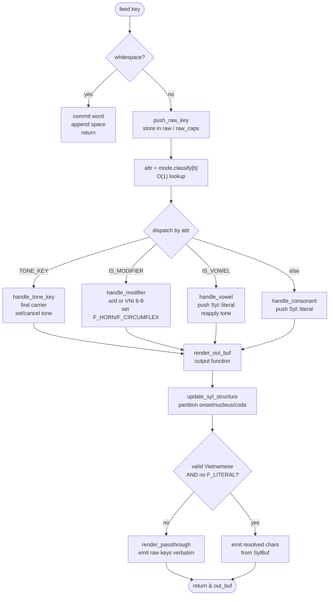

# uvie-rs Engine Architecture

`uvie-rs` is an incremental, stateful Vietnamese input method engine supporting Telex and VNI. It is designed for `no_std` / `no-alloc` environments, uses zero external dependencies in core logic, and targets sub-microsecond latency per keystroke.

## Design Principles

The engine is modeled as a **Mealy machine** — a finite-state transducer where each keystroke (input symbol) combined with the current `SylBuf` state (state) produces both a new state and an output (the rendered character). This differs from a Moore machine, where output depends only on state. The Mealy model is a natural fit for IME engines:

- **Output depends on input + state**: typing `s` after `tie` produces `tiế` (tone applied), but typing `s` after `ban` produces `bans` (literal — `s` is a coda, not a tone key). Same input symbol, different output, determined by current syllable state.
- **State transitions are bit-flips**: each `Syl` entry stores `base`, `out`, `tone`, `flags`. A keystroke flips bits on the right entry (set `F_CIRCUMFLEX`, change `tone`, etc.) — no multi-pass reordering.
- **Single-pass per keystroke**: classify input → dispatch to handler → mutate state → render output. No replay, no compact(), no external boundary detector.

1. **Validate raw keystrokes, not resolved output.** The engine checks the raw ASCII sequence against positive syllable tables *before* applying any transform. This makes English passthrough automatic - if the raw keys do not form a legal Vietnamese syllable pattern, the word is emitted verbatim.

2. **Per-character state.** Every typed key gets a `Syl` entry storing its raw base, resolved display char, tone, and modifier flags. Transforms are bit-flips on the right element; no multi-pass bubbling or reordering.

3. **Incremental, not replay.** The engine mutates state in-place per keystroke. There is no full-buffer replay on every key, no `compact()` step, and no external V-C-V boundary detector.

4. **No heap in the hot path.** All buffers are fixed-size stack arrays. `StackStr<N>` (a stack-allocated UTF-8 buffer with `Deref<Target=str>`) replaces `String` for `OutBuffer` and `RawBuffer`. `CharVec<N>` tracks raw keystrokes. `SylBuf` is a fixed `[Syl; 24]` array. Zero allocations per keystroke, zero external dependencies.

5. **Diff-based IME API.** The engine computes `(backspace_count, suffix_to_type)` for each keystroke, which is exactly what a macOS input method or terminal IME needs to update the screen with minimal edits.

6. **O(1) backspace via snapshot stack.** Each keystroke pushes a `ComposingSnapshot` (buf + raw_chars + prev_rendered). On backspace, the snapshot is popped and state restored instantly — no O(n²) replay through the engine.

---

## State Model

### `Syl` - one entry per typed key

```rust
#[derive(Clone, Copy, Default)]
pub struct Syl {
    pub base: u8,      // raw ASCII key, lowercased: b'a', b'e', b'd', b's', ...
    pub out: char,     // resolved display character
    pub tone: u8,      // 0=none, 1=sắc, 2=huyền, 3=hỏi, 4=ngã, 5=nặng
    pub flags: u8,     // CIRCUMFLEX | HORN | CAPS | LITERAL | TONE_SET
}
```

`flags` is a bitfield:

| Bit | Meaning |
|-----|---------|
| `F_CIRCUMFLEX` | `â ê ô` (aa→â, ee→ê, oo→ô) |
| `F_HORN` | `ă ơ ư` (aw→ă, ow→ơ, uw→ư); also repurposed for `đ` |
| `F_CAPS` | physical key was uppercase |
| `F_LITERAL` | entry is frozen (passthrough / triple-cancel) |
| `F_TONE_SET` | `tone` field is meaningful (distinguishes "no tone" from "tone cleared") |

`out` is recomputed from `base + flags + tone` whenever any of them change. Tone is always applied *after* modifier resolution, so the lookup path is deterministic.

### `UltraFastViEngine` - top-level state

```rust
pub struct UltraFastViEngine {
    buf: SylBuf,              // current composing word (max 24 chars)
    raw: CharVec<24>,         // raw keystroke snapshot (stack, no heap)
    raw_caps: [bool; 24],     // uppercase flags parallel to raw
    raw_len: usize,
    out_buf: OutBuffer,       // StackStr<128> — rendered output of current word
    committed: OutBuffer,     // StackStr<128> — prior committed text
    input_method: InputMethod,
    mode: &'static Mode,      // classify + tone tables for current method
    enable_quick_start: bool,
    enable_quick_telex: bool,
    enable_modern_orthography: bool,
    enable_relaxed_coda: bool,
    syl_structure: SylStructure,  // onset/nucleus/coda partition
    diff: DiffState,          // diff-mode tracking + snapshot stack for O(1) backspace
}
```

`raw` and `raw_caps` are snapshots of the exact keys typed. They are used for:
- passthrough rendering when the word is invalid Vietnamese,
- backspace (replay the prefix through the engine),
- diff baseline computation.

---

## Per-Keystroke Flow

The Mealy machine transition function: `(state, input) → (state', output)`.



Text form:

```
feed(key):                              # input symbol
  lower = key.to_ascii_lowercase()
  caps  = key != lower

  if key is whitespace:
      commit current word, append space, return

  push_raw_key(lower, caps):
      store in raw[] / raw_caps[]
      process_key(b, caps):             # transition function
          attr = mode.classify[b]        # O(1) input classification
          dispatch by attr:              # state-dependent output
              TONE_KEY  → handle_tone_key()
              MODIFIER  → handle_modifier()
              VOWEL     → handle_vowel()
              else      → handle_consonant()

  render_out_buf():                     # output function (state → display)
      update_syl_structure()            # partition onset/nucleus/coda
      if any F_LITERAL or invalid Vietnamese:
          render_passthrough()          # emit raw keys verbatim
      else:
          emit resolved chars from buf

  return &out_buf                       # output symbol
```

### Classification

Each input mode (Telex / VNI) owns a `classify` lookup table: 256 `u8` values where bits mark `IS_VOWEL`, `IS_TONE_KEY`, `IS_MODIFIER`. Classification is a single array index - O(1).

### Vowel handling (`composing.rs`)

- Plain vowel: push `Syl::literal()`, then `reapply_tone_after_nucleus_change()`.
- Double-vowel modifier (`aa`, `ee`, `oo`): find the matching target in the buffer. If target already has `F_CIRCUMFLEX` and the word is valid Vietnamese, triple-cancel: revert target to literal, push new literal, mark entire word `F_LITERAL`. Otherwise, set `F_CIRCUMFLEX` on target and reapply tone.

### Modifier handling (`modifier.rs`)

- `w` (Telex): search nucleus backwards for `a`, `o`, `u`. Apply `F_HORN` (or cancel if already set). Special-cases for consecutive `uu` sequences and coda presence.
- `d` (Telex): apply `F_HORN` to a `d` → `đ`.
- `6/7/8/9` (VNI): apply circumflex / horn / horn / đ respectively.

Modifiers only affect vowels inside the identified nucleus; consonants outside the nucleus are never touched.

### Tone handling (`tone_handler.rs`)

1. Map raw key to tone value via `mode.tone` table.
2. If the word is already invalid → treat tone key as plain consonant.
3. Find tone carrier via `tone_carrier_idx()`:
   - partition syllable into onset / nucleus / coda,
   - look up `nucleus_tone_target(nucleus_chars)` → index within nucleus,
   - adjust for `gi-` / `qu-` onset rules.
4. If a carrier exists:
   - same tone already set + key matches → cancel tone, push key as literal (double-cancel).
   - else → set tone on carrier, clear any previous tone.
5. If no carrier → push key as literal.

`reapply_tone_after_nucleus_change()` is called after any modifier that may alter nucleus shape (e.g. `aw` → `ă` changes tone target from `a` to `ă`). It recomputes the carrier and moves the tone if necessary.

### Validation (`validation.rs`)

Validation runs on the **raw** sequence, not the resolved output:

1. `partition_syllable()` scans the buffer to find onset end, nucleus start/end, and coda start.
2. `is_valid_vietnamese()` checks:
   - `is_legal_onset(raw[..onset_end])`
   - `is_legal_nucleus(base_no_tone of nucleus chars)`
   - `is_legal_coda(raw[coda_start..])`
   - `tone_allowed_for_coda(coda, tone)` (e.g. `c/ch/p/t` only allow sắc / nặng)

All tables in `tables.rs` are positive (whitelist) tables. There are no blacklists or heuristic guesses.

---

## Diff Engine (`diff.rs`)

The core engine returns the full composing text after each keystroke. An IME usually needs minimal edits: "delete N chars on screen, type this new suffix". The diff layer provides that.

### V-C-V auto-split

Vietnamese words are single-syllable. When the user types a vowel after a completed syllable (e.g. `dant` → `dân` + `t`), the engine must commit the previous syllable and start a new word. The diff layer detects this by tracking the last valid Vietnamese render. If the current render becomes invalid while the previous state was valid, the previous valid output is committed and the new keystroke starts a fresh word.

V-C-V split uses a `thread_local` scratch engine instead of allocating a fresh `UltraFastViEngine` on each split — avoids heap allocation on the forward path.

### Diff computation

```
feed_diff(key):
  feed(key) into inner engine
  if V-C-V split detected:
      commit previous valid word (via thread_local scratch engine)
  push ComposingSnapshot onto snapshot stack
  compare new render vs prev_rendered
  compute (backspace_count, suffix) via single-pass char counting
  update prev_rendered
  return (backspace_count, suffix)
```

`backspace_diff()` pops the last `ComposingSnapshot` from the stack and restores state instantly — O(1) instead of O(n²) replay. The snapshot stores `buf`, `raw_chars`, and `prev_rendered` (all stack-allocated, no heap).

### `partition_syllable()` cache

`partition_syllable()` is called multiple times per keystroke (validation, tone carrier selection, coda rules). `SylBuf` carries a `version()` counter that increments on every mutation. The diff layer caches the last partition result and validates it with a single version check — O(1) cache hit vs O(n) rescan.

---

## Module Map

| File | Responsibility |
|------|----------------|
| `lib.rs` | Module tree, feature gating (`std` / `no_std`), public re-exports |
| `engine.rs` | `UltraFastViEngine` struct, lifecycle, configuration, `feed()` / `backspace()` / `commit()` |
| `syllable.rs` | `Syl` struct, `SylBuf` fixed array buffer with version counter, `SylStructure` onset/nucleus/coda slots, modifier resolution helpers |
| `composing.rs` | `Composable` trait: key classification, vowel/consonant dispatch, rendering (resolved + passthrough) |
| `modifier/mod.rs` | `ModifierHandler` trait dispatch |
| `modifier/telex.rs` | Telex modifiers: `w`, `d`, double-vowel circumflex, triple-cancel |
| `modifier/vni.rs` | VNI modifiers: 6/7/8/9 |
| `modifier/double.rs` | Double-vowel circumflex logic (`aa`, `ee`, `oo`) |
| `tone_handler.rs` | `ToneHandler` trait: tone key mapping, carrier selection, tone move after nucleus change |
| `validation.rs` | `SyllableValidator` trait: syllable partitioning, positive-table validation |
| `tables/mod.rs` | Static lookup tables module root |
| `tables/onset.rs` | Legal onset consonants/clusters |
| `tables/nucleus.rs` | Legal nucleus vowel combinations |
| `tables/coda.rs` | Legal coda consonants/clusters |
| `tables/glide.rs` | Glide (semi-vowel) onset rules |
| `modes.rs` | `Mode` tables for Telex and VNI: `classify[256]`, `tone[256]`, mode trait |
| `tone.rs` | Unicode tone mapping: base vowel + tone index → precomposed Unicode char |
| `buffers.rs` | `StackStr<N>` (stack-allocated UTF-8, `Deref<Target=str>`), `CharVec<N>`, `OutBuffer`/`RawBuffer` type aliases — zero heap, zero deps |
| `diff/mod.rs` | `Diffable` trait: V-C-V split detection, minimal-edit diff for IME consumption |
| `diff/core.rs` | `feed_diff_core` / `backspace_diff` implementation, branch-optimized hot path |
| `diff/state.rs` | `DiffState`: snapshot stack (`ComposingSnapshot`), scratch buffers, `prev_rendered` tracking |
| `diff/utils.rs` | Diff helpers: single-pass char counting, `diff_into` |
| `ffi.rs` | C ABI: `uvie_engine_new`, `uvie_feed`, `uvie_backspace`, `uvie_set_mode`, etc. Mutex-wrapped for thread safety |
| `tests.rs` | Exhaustive test suite covering Telex, VNI, quick telex, quick start, modern orthography, relaxed coda, macros, backspace, edge cases |

---

## FFI / Swift Integration

The Rust library compiles to `staticlib` + `cdylib`. The Swift macOS app ([UVieKey](https://github.com/thuupx/UVieKey)) links against `libuvie.a` and calls the C API:

- `uvie_engine_new()` / `uvie_engine_free()` - lifecycle
- `uvie_feed(engine, key, &bs, suffix, suffix_len)` - returns backspace count and writes suffix
- `uvie_backspace(engine, &bs, suffix, suffix_len)` - same, for backspace
- `uvie_set_mode(engine, method)` - switch Telex / VNI
- `uvie_set_quick_telex()`, `uvie_set_modern_orthography()`, etc. - feature toggles

All engine state lives inside an opaque `UvieEngine` pointer; Swift never touches Rust structs directly.

---

## Performance Characteristics

- **Classification**: O(1) array lookup.
- **Syllable partition**: O(syllable length) ≤ O(24) — scans the buffer once. Cached via `SylBuf.version()` — O(1) cache hit on repeated calls within the same keystroke.
- **Validation**: O(1) — positive table lookups on bounded slices.
- **Rendering**: O(syllable length) — single pass over `SylBuf`.
- **Backspace**: O(1) — pops `ComposingSnapshot` from stack, restores state instantly. No replay through engine.
- **Diff computation**: O(syllable length) — single-pass char counting via `diff_into`.
- **Memory**: all fixed-size stack arrays (`StackStr`, `CharVec`, `SylBuf`). Zero allocator calls per keystroke. Zero external dependencies.

Benchmarks on Apple Silicon (v2.1.0): ~16× speedup over the `vi` crate for typical input. Diff API: 307 ns – 5.99 µs per keystroke depending on word complexity, 2.41 µs for backspace.

---

## Known Limitations / Trade-offs

- **Syllable length cap**: 24 chars. Longer input is silently truncated. This covers all practical Vietnamese words.
- **Tone on `gi-` / `qu-`**: The engine places the tone on the second vowel in `gi` / `qu` onset sequences (e.g. `quas` → `quá`). This is handled explicitly in `tone_carrier_idx()`.
- **Traditional orthography tone placement**: Tone on first vowel for open syllables (`hoá`), second vowel for syllables with coda (`hoạt`, `đoán`). `apply_coda_tone_rules()` fixes this at render time. Toggleable via `modern_orthography`.
- **Snapshot stack overhead**: O(1) backspace adds slight overhead on the forward path (+~27%) due to snapshot push, but eliminates O(n²) backspace replay — net win for typical typing.
- **No sentence-level context**: The engine operates word-by-word. It does not attempt to disambiguate homophones or do NLP.
